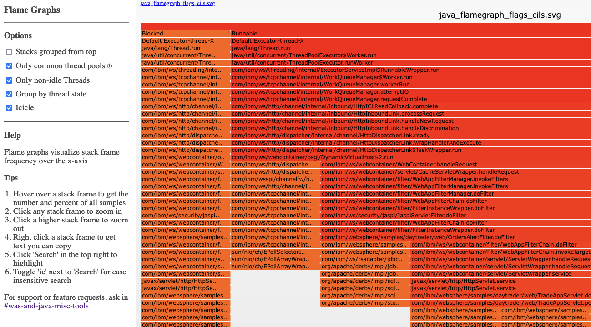

# Thread Dump Flame Grapher

Thread Dump Flame Grapher (TDFG) converts thread dumps of various forms into [flame graphs](https://www.brendangregg.com/flamegraphs.html).

## Usage

1. Clone this repository:
   ```
   git clone https://github.com/IBM/ThreadDumpFlameGrapher
   ```
1. Change directory into the clone:
   ```
   cd ThreadDumpFlameGrapher
   ```
1. Run the shell script on input files or directories:
   ```
   ./flamegraph.sh javacore*txt
   ```
1. Open the generated `flamegraph_list.html` in a browser

## Screenshot



## Files

* [LICENSE](LICENSE)
* [CONTRIBUTING.md](CONTRIBUTING.md)
* [MAINTAINERS.md](MAINTAINERS.md)
* [CHANGELOG.md](CHANGELOG.md)

## Notes

If you have any questions or issues you can create a new [issue here][issues].

Pull requests are very welcome! Make sure your patches are well tested.
Ideally create a topic branch for every separate change you make. For
example:

1. Fork the repo
2. Create your feature branch (`git checkout -b my-new-feature`)
3. Commit your changes (`git commit -am 'Added some feature'`)
4. Push to the branch (`git push origin my-new-feature`)
5. Create new Pull Request

## License

All source files must include a Copyright and License header. The SPDX license header is 
preferred because it can be easily scanned.

If you would like to see the detailed LICENSE click [here](LICENSE).

```text
#
# Copyright IBM Corporation. All Rights Reserved.
# SPDX-License-Identifier: Apache-2.0
#
```
## Authors

- Author: Kevin Grigorenko - <mailto:kevin.grigorenko@us.ibm.com>
- Author: Leon Foret - <mailto:ljforet@us.ibm.com>

[issues]: https://github.com/IBM/ThreadDumpFlameGrapher/issues/new
